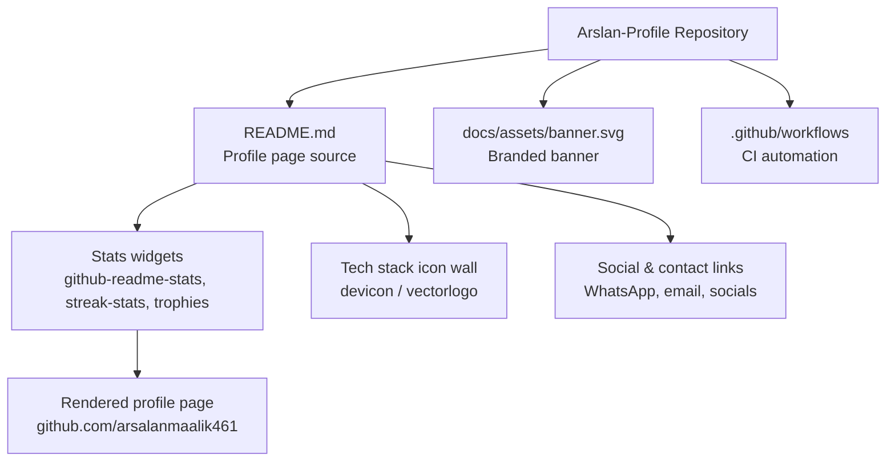

<p align="center">
  
</p>

<p align="center">
  
  
  
  
  
  
  
  
</p>

> **Developed by [Arslan Malik](https://github.com/arsalanmaalik461)**
> 📱 WhatsApp: [+92 300 8987448](https://wa.me/923008987448) · 🌐 Website: [arslanmalik.tech](https://arslanmalik.tech)

---

## 🌟 Executive Overview

**Arslan-Profile** is the personal GitHub profile repository of Arslan Malik, a developer from Pakistan working across Android and iOS apps, websites, and blockchain projects. The repository hosts the GitHub profile README — the landing page visitors see on the profile — covering the developer's current focus areas, freelance services (bug fixing, readymade and custom applications and websites), contact channels, a technology stack icon wall, and live profile statistics widgets such as language breakdowns, contribution streaks, and trophy cards.

This repository is a living portfolio artifact: it contains the profile README itself plus CI configuration under `.github/workflows/`. It is not an application codebase, so there is no build step, dependency manifest, or runtime to install — customizing it is a matter of editing Markdown and pushing. Everything here is static content designed to render on github.com, and it follows the same rule as every other repository documented under the Arslan Malik brand: English-only content, honest claims grounded in what the repository actually contains, and current branding (banner, WhatsApp contact, arslanmalik.tech link) at the top.

---

## 📑 Table of Contents

- [✨ Key Features & Highlights](#-key-features--highlights)
- [🖥️ Feature Showcase](#️-feature-showcase)
- [🏗️ System Architecture](#️-system-architecture)
- [🚀 Quickstart & Installation Guide](#-quickstart--installation-guide)
- [📂 Project Structure](#-project-structure)
- [🛡️ Security & Notes](#️-security--notes)

---

## ✨ Key Features & Highlights

| Feature | Description |
| :--- | :--- |
| Branded profile banner | Custom `docs/assets/banner.svg` header with the developer name and branding |
| About & focus section | Current work (blockchain tokens), freelance services (bug fixing, readymade/custom apps & websites) |
| Tech stack icon wall | Icons for the languages and frameworks the developer works with (Android, Flutter, Kotlin, Laravel, PHP, Python, Node.js, React, databases, and more) |
| Live GitHub stats widgets | Top-languages card, contribution streak card, and profile trophies rendered from public GitHub data |
| Social & contact links | Twitter/X, LinkedIn, Facebook, Instagram, YouTube, email, and WhatsApp (+92 300 8987448) |
| CI workflows | GitHub Actions configuration under `.github/workflows/` |

---

## 🖥️ Feature Showcase

### 1. GitHub Profile README

> A single Markdown file that renders as the developer's public profile page on GitHub.

- Branded banner, headline, and bio introducing Arslan Malik and his service areas
- "Currently working on", "Looking for new projects", and contact lines for freelance work
- Tech-stack icon wall built with devicon / vectorlogo assets
- Live statistics: top languages, streak stats, and profile trophies

### 2. CI Workflows

> Automation configuration for this repository, stored in `.github/workflows/`.

- Keeps repository automation (if configured) version-controlled alongside the profile content
- Standard GitHub Actions YAML layout — inspect `workflows/` to see exactly what runs

---

## 🏗️ System Architecture



---

## 🚀 Quickstart & Installation Guide

This is a static profile repository — there is nothing to build or install. To make it your own:

### Prerequisites

- A GitHub account
- Git installed locally

### Step-by-Step Installation

```bash
# 1. Clone the repository
git clone https://github.com/arsalanmaalik461/Arslan-Profile.git
cd Arslan-Profile

# 2. Edit the profile content
#    Open README.md in any editor and replace the name, bio,
#    stack icons, and social links with your own.

# 3. Replace the banner (optional)
#    Edit docs/assets/banner.svg to match your branding.

# 4. Commit and push — GitHub renders README.md automatically
git add -A
git commit -m "docs: update profile README"
git push origin main
```

> Note: GitHub only shows a repository's README on the profile page when the repository name matches your username. For other repositories, the README simply renders on the repository's main page.

---

## 📂 Project Structure

```
Arslan-Profile/
├── README.md                 # Profile page source (this document)
├── docs/
│   └── assets/
│       └── banner.svg        # Branded banner image shown at the top
└── .github/
    └── workflows/            # GitHub Actions CI configuration
```

---

## 🛡️ Security & Notes

- This repository contains **no application code, credentials, tokens, or secrets** — it is static Markdown, SVG, and workflow YAML only.
- Profile statistics widgets (github-readme-stats, streak-stats, trophies) are rendered by **third-party services** from public GitHub data; if any widget is unavailable, the surrounding content still renders.
- Do not paste real credentials into `README.md` or workflow files — public repositories are visible to everyone.
- All claims in this document describe the repository's actual contents as of this writing.

---

<p align="center">
  <sub>Developed with ❤️ by <a href="https://github.com/arsalanmaalik461">Arslan Malik</a> · 📱 <a href="https://wa.me/923008987448">WhatsApp: +92 300 8987448</a> · 🌐 <a href="https://arslanmalik.tech">arslanmalik.tech</a></sub>
</p>
